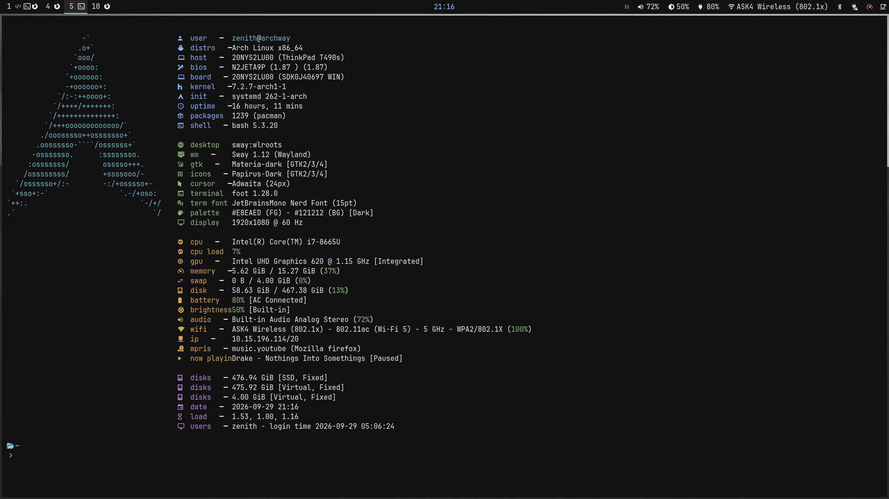

# Archway Dotfiles

Personal dotfiles for a minimal, keyboard-first Arch Linux desktop built around Sway and Wayland.

## Preview



## What is in this repo

This repository is the source of truth for the desktop configuration used on my daily machine. It includes:

- shell setup in `.bashrc`
- Sway configuration under `.config/sway/`
- Waybar configuration and styling under `.config/waybar/`
- application settings for Foot, Rofi, Dunst, MPV, Kanshi, Swaylock, and Zed
- the package inventory in `pkglist.txt`
- KeePassXC Browser and uBlock Origin helper files

Edit the files in the cloned repository, not separate copies under `$HOME`. The home-directory entries are symlinks to this repository.

## Repo layout

```text
.
├── .bashrc
├── .config/
│   ├── dunst/
│   ├── fastfetch/
│   ├── foot/
│   ├── kanshi/
│   ├── keepassxc/
│   ├── mpv/
│   ├── nix/
│   ├── rofi/
│   ├── starship.toml
│   ├── sway/
│   │   ├── config
│   │   ├── outputs
│   │   └── workspaces
│   ├── swaylock/
│   ├── waybar/
│   │   ├── config.jsonc
│   │   └── style.css
│   ├── xdg-desktop-portal-wlr/
│   └── zed/
├── keepassxc-browser_settings.json
├── my-ublock-static-filters.txt
├── pkglist.txt
├── assets/
│   └── archway-desktop.png
├── README.md
```

## Core desktop stack

- OS: Arch Linux
- Compositor: Sway
- Bar: Waybar
- Terminal: Foot
- Launcher: Rofi
- Notifications: Dunst
- Screen locker: Swaylock
- Wallpaper: Swaybg
- Display management: Kanshi
- Audio: PipeWire + WirePlumber
- Network management: NetworkManager and `nmtui`
- Bluetooth management: BlueZ, Blueman, and `bluetui`
- Browser: Firefox
- File manager: Thunar
- Image viewer: imv
- Media player: mpv
- PDF viewer: Zathura
- Clipboard / utilities: various Wayland-friendly tools

## Installation and symlinks

These steps install the packages and connect the configuration to your home directory.

1. Clone the repository:

```bash
git clone https://github.com/nanda-kumudhan/dotfiles.git ~/Github/dotfiles
cd ~/Github/dotfiles
```

2. Back up any existing files or directories before creating the links. The commands below use the repository's current path and create **absolute symlinks**:

```bash
mkdir -p "$HOME/.config"
ln -s "$PWD/.bashrc" "$HOME/.bashrc"
for path in "$PWD"/.config/*; do
    ln -s "$path" "$HOME/.config/$(basename "$path")"
done
```

The repository contains both configuration directories and individual files such as `.config/starship.toml`. On another device, run these commands again from that device's clone; `$PWD` ensures the links point to the correct local path. Do not run them over existing paths without backing those paths up first.

3. Install the system packages listed in `pkglist.txt`:

```bash
sudo pacman -S --needed - < pkglist.txt
```

If you use an AUR helper like `yay`, you can also install additional packages from the same list as needed for your environment.

4. Reload Sway after changing its configuration:

```text
Super+Shift+r
```

Changes to the symlinked files are immediately available to the relevant applications. Commit and push changes from the repository:

```bash
git add .
git commit -m "update desktop configuration"
git push
```

## Common command-line tools

After installing the packages, these terminal interfaces are available:

### NetworkManager

Launch the NetworkManager text interface with:

```bash
nmtui
```

Use it to connect to Wi-Fi, manage saved connections, and configure network interfaces. NetworkManager must be running for it to work.

### Bluetooth

Launch the Bluetooth text interface with:

```bash
bluetui
```

Use it to discover, pair, connect, and disconnect Bluetooth devices. Make sure the Bluetooth service is running first:

```bash
sudo systemctl enable --now bluetooth
```

### Starship

The shell prompt is configured by `.config/starship.toml` and loaded from `.bashrc`:

```bash
eval "$(starship init bash)"
```

## Keyboard shortcuts

Sway uses `Mod4` as the **Super/Windows key** and `Mod1` as **Alt**. The shortcuts below match `.config/sway/config`.

### Launchers and session

| Shortcut | Action |
| --- | --- |
| `Ctrl+Alt+t` | Open Foot terminal |
| `Super+e` | Open the Rofi file browser |
| `Super+Shift+e` | Open Thunar |
| `Super+Space` | Open the Rofi application launcher |
| `Super+Shift+q` | Close the focused window |
| `Super+l` | Lock the screen |
| `Ctrl+Escape` | Open `htop` in a terminal |
| `Super+w` | Open Firefox |
| `Super+k` | Open KeePassXC |
| `Super+z` | Open Zed |
| `Super+Shift+s` | Suspend the system |
| `Ctrl+Alt+Delete` | Open the session menu and log out |

### Screenshots and recording

| Shortcut | Action |
| --- | --- |
| `Print` | Save a full-screen screenshot to `~/Pictures/Screenshots/` |
| `Shift+Print` | Select an area and save a screenshot |
| `Ctrl+Print` | Start or stop a full-screen recording in `~/Videos/Recordings/` |
| `Ctrl+Shift+Print` | Start or stop an area recording |

### Window management

| Shortcut | Action |
| --- | --- |
| `Super+h` | Split horizontally |
| `Super+v` | Split vertically |
| `Super+r` | Toggle split layout |
| `Super+f` | Toggle fullscreen |
| `Super+d` | Toggle floating mode |
| `Super+Shift+d` | Toggle sticky mode |
| `Super+Shift+p` | Open `wdisplays` |
| `Super+c` | Make the window floating, resize it, and center it |
| `Super+t` | Use tabbed layout |
| `Super+s` | Use stacking layout |
| `Super+Shift+r` | Reload the Sway configuration |
| `Super+Plus` | Grow the window width |
| `Super+Minus` | Shrink the window width |
| `Super+Arrow` | Focus a window in that direction |
| `Super+a` | Focus the parent container |
| `Super+Shift+a` | Focus the child container |
| `Super+Shift+Arrow` | Move the window in that direction |
| `Alt+Tab` | Focus the next window |
| `Alt+Shift+Tab` | Focus the previous window |

### Workspaces

| Shortcut | Action |
| --- | --- |
| `Super+1` through `Super+0` | Switch to workspaces 1 through 10 |
| `Super+Shift+1` through `Super+Shift+0` | Move the focused window to workspaces 1 through 10 |
| `Super+Ctrl+Left/Right` | Move the current workspace to the left/right output |
| `Super+Tab` | Switch to the next workspace |
| `Super+Shift+Tab` | Switch to the previous workspace |

### Scratchpad and controls

| Shortcut | Action |
| --- | --- |
| `Super+Shift+Grave` | Move the focused window to the scratchpad |
| `Super+Grave` | Show the scratchpad |
| `Super+n` | Open the NetworkManager UI (`nmtui`) |
| `Super+b` | Open the Bluetooth UI (`bluetui`) |
| `Super+XF86AudioMute` | Open the audio mixer |

### Hardware keys

| Key | Action |
| --- | --- |
| `XF86AudioMute` | Toggle speaker mute |
| `XF86AudioLowerVolume` / `XF86AudioRaiseVolume` | Lower/raise speaker volume |
| `XF86AudioMicMute` | Toggle microphone mute |
| `XF86Tools` | Open the audio mixer |
| `XF86Display` (F7) | Open `wdisplays` |
| `XF86AudioPrev` / `XF86AudioNext` | Previous/next media track |
| `XF86AudioPlay` | Play/pause media |
| `XF86AudioStop` | Stop media |
| `XF86MonBrightnessDown` / `XF86MonBrightnessUp` | Lower/raise screen brightness |

Three-finger touchpad swipes control media: swipe left for previous track, right for next track, and up for play/pause. Closing the laptop lid disables the internal display; opening it enables the display again.

The settings/tools key currently opens the audio mixer (`pavucontrol`). It can also be assigned to a display layout tool such as `wdisplays`, the NetworkManager UI (`nmtui`), the Bluetooth UI (`bluetui`), or a custom settings launcher.

## Notes

- This is a personal setup and may not fit every machine out of the box.
- Some files may contain machine-specific paths or preferences.
- Review config files before applying them to a new system.

## License

This repository is for personal configuration and is shared as-is for reference and reuse.
