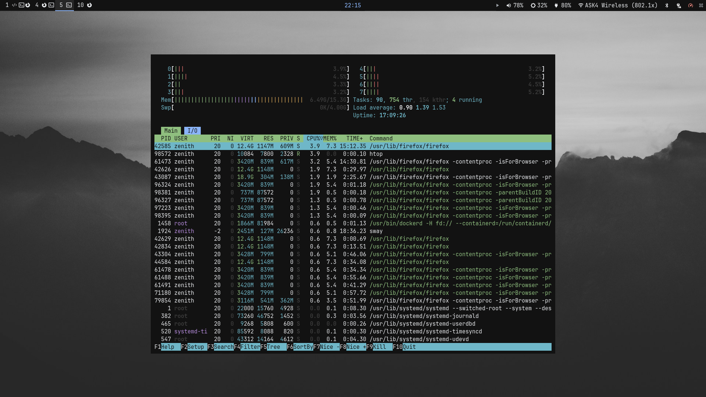
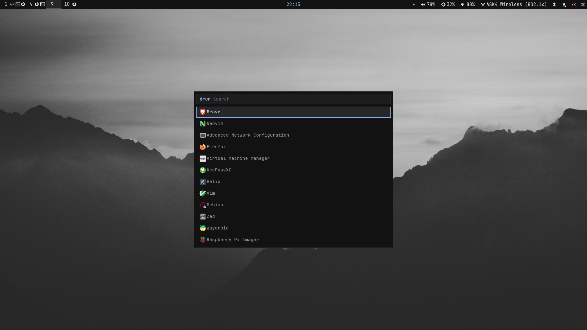

# Archway

My personal Arch Linux setup, built around Sway and Wayland.

## Screenshots

## Setup

- **Desktop:** Sway, Waybar, Rofi, Dunst, and Swaylock
- **Terminal:** Foot, Bash, and Starship
- **Apps:** Firefox, Thunar, Zed, mpv, and Zathura
- **System:** PipeWire, WirePlumber, NetworkManager, and BlueZ

Configs live in `.config/`, shell settings are in `.bashrc`, and packages are listed in `pkglist.txt`. Browser settings and filters are included too.

These are my own preferences, with a few machine-specific settings. Shared for reference and reuse.
